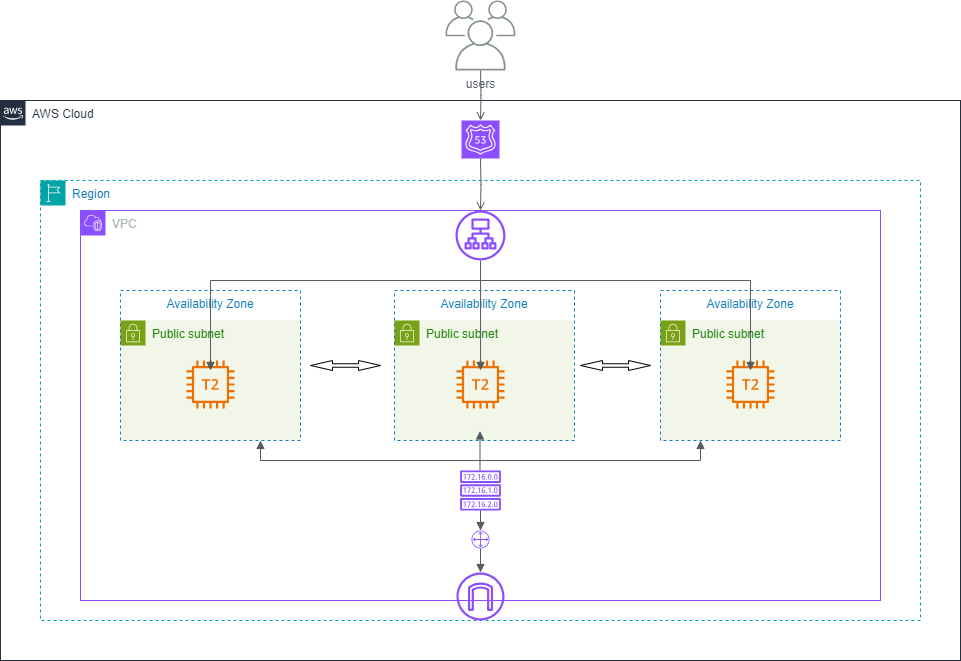
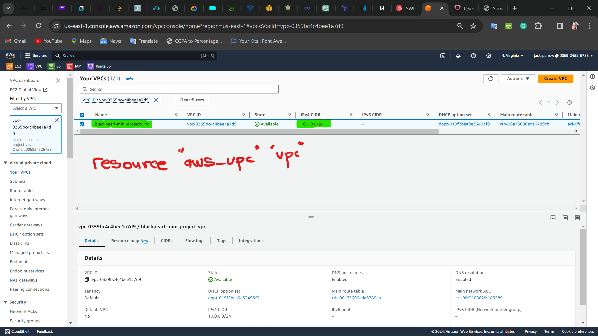
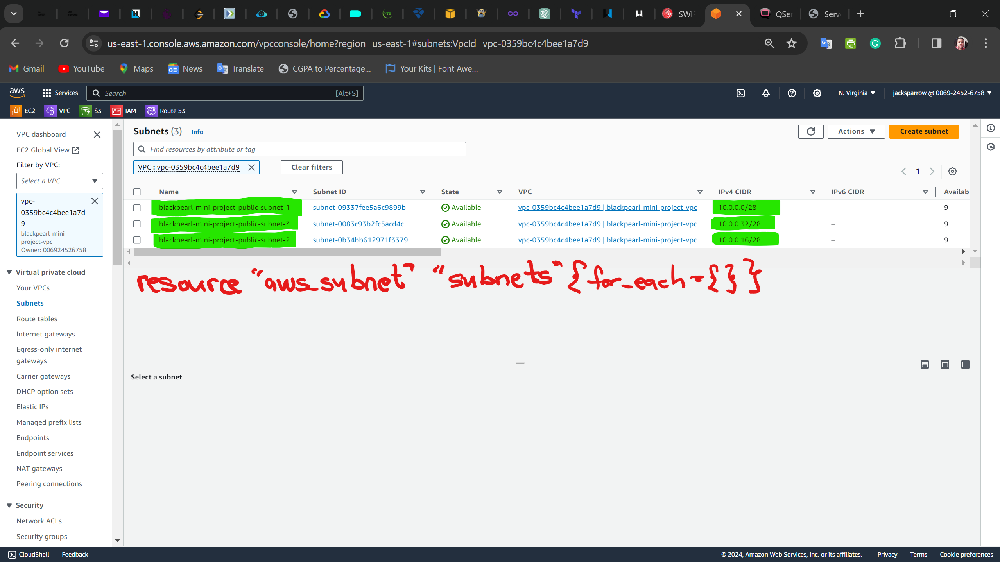
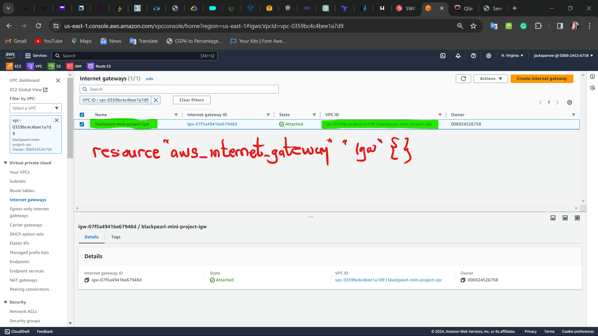
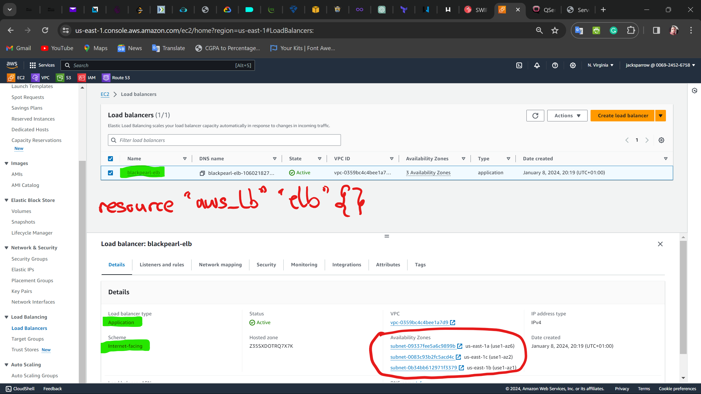

# Mini-Project Documentation

## Table of Contents

- [1. Introduction](#1-introduction)
- [2. Architecture](#2-architecture)
- [3. Requirements](#3-requirements)
- [4. Usage](#4-usage)
- [5. Directory Structure](#5-directory-structure)
- [6. Modules](#6-modules)
- [7. Ansible](#7-ansible)
- [8. blackpearl-project](#8-blackpearl-project)
- [9. Bash script](#9-bash-script)
- [10. Backend](#10-backend)
- [11. Testing](#11-testing)
- [12. Contributing](#12-contributing)
- [13. Author](#13-author)
- [14. Acknowledgements](#14-acknowledgements)
- [15. Conclusion](#15-conclusion)

## 1. Introduction

Blackpearl project is a mini project in the AltSchool Cloud engineering V2 program. The project uses terraform to create 3 EC2 instances and puts them behind an Elastic load balancer (Application load balancer), the project requires the terraform script after application to export the public IP addresses of the 3 EC2 instances to a file called `host-inventory` which is used by ansible to configure the EC2 instances. The ansible playbook installs and configures Apache2 web server on the EC2 instances and also creates a default `index.html` file on the web server, it also changes the timezone to Africa/Lagos on the Apache2 web server, the hostname, IP address and the timezone are displayed on the web server's default page. A `.com.ng` domain name was purchased from [Qserver](https://www.qservers.net) and the DNS records were configured to point to the Elastic load balancer. The project also uses a bash script to automate the deployment of the application.
the project is successfully deployed when terraform-test.domain name is entered in a web browser and the web page displays the hostname, IP address and the timezone of the EC2 instances.

## 2. Architecture



## 3. Requirements

- Terraform installed on your local machine
- Ansible installed on your local machine
- AWS CLI installed on your local machine
- AWS account
- Qserver account or any other domain name registrar
- A domain name.

## 4. Usage

- Clone the repository to your local machine

- Create a file called `terraform.tfvars` in the `blackpearl-project` directory and add the values for the following variables to the file:

```bash
region=""
profile=""
cidr_block=""
project-name=""
instance_type=""
domain-name=""
subdomain-name=""
```

- Go to the backend.tf file and change the bucket name to a unique name and also change other values if necessary.

- Navigate to the `ansible` directory and edit the paths to the private key and the `host-inventory` file in the `ansible.cfg` file.

- Navigate to the blackpearl-project directory and edit the paths to directories appropriately in the `apply.sh` and `destroy.sh` files and ensure make both files executable by running the following commands:

```bash
chmod +x apply.sh
chmod +x destroy.sh
```

- Initialize terraform by running the following command:

```bash
terraform init
```

- Check for errors by running the following command:

```bash
terraform validate
```

- Check for changes by running the following command:

```bash
terraform plan
```

- Run the `apply.sh` file to deploy the application and run the `destroy.sh` file to destroy the application.

- After the application has been deployed, enter the domain name in a web browser to view the web page.

## 5. Directory Structure

```bash
├── ansible
│   ├── ansible.cfg
│   ├── apache2.yml
│   ├── host-inventory.ini
│   ├── index.html.j2
│   └── server-info.php.j2
├── blackpearl-project
│   ├── .gitignore
│   ├── apply.sh
│   ├── backend.tf
│   ├── destroy.sh
│   ├── main.tf
│   ├── provider.tf
│   ├── terraform.tfvars
│   └── variables.tf
├── modules
│   ├── ec2
│   │   ├── main.tf
│   │   ├── outputs.tf
│   │   └── variables.tf
│   ├── elb 
│   │   ├── main.tf
│   │   ├── outputs.tf
│   │   └── variables.tf
│   ├── sg 
│   │   ├── main.tf
│   │   ├── outputs.tf
│   │   └── variables.tf
│   └── vpc
│       ├── main.tf
│       ├── outputs.tf
│       └── variables.tf
├── README.md
```

## 6. Modules

- The project uses 4 modules which are:

  - VPC module

  The vpc module creates a vpc, 3 public subnets, 1 internet gateway, 1 route table, and 1 route table association.

  

  In the aws_subnet resource, the `for_each` meta-argument is used to create 3 public subnets in 3 different availability zones. and the `cidrsubnet` variable is used to generate the cidr blocks for the subnets.

  

  

  A route table is created and an internet gateway is attached to the route table. The route table is associated with the public subnets. this was to ensure that the EC2 instances will be able to communicate with the internet.

  

  

  - Security group module

  The security group module creates 2 security groups, one for the EC2 instances and the other for the Elastic load balancer.

  The security group for the EC2 instances allow inbound traffic on port 22, 80, 443 and ICMP traffic from the internet

  

  and allow all outbound traffic to the internet.

  

  The security group for the Elastic load balancer allows inbound traffic on port 80 and 443 from the internet.

  

  and allows all outbound traffic to the internet.

  

  - EC2 module

  The EC2 module creates 3 EC2 instances and attaches them to the security group created by the security group module.

  The EC2 instances are created in the public subnets created by the VPC module.

  

  - Elastic load balancer module and Route53 module

  The Elastic load balancer module creates an Application load balancer and attaches it to the security group created by the security group module.

  The Application load balancer is created in the public subnets created by the VPC module.

  

  A target group is created and the EC2 instances are registered to the target group.

  

  A listener is created and the target group is attached to the listener.

  

  The elb module creates a route53 hosted zone and a record set for the domain name.

  

  

  After applying the terraform script, the public IP addresses of the EC2 instances are exported to a file called `host-inventory` which is used by ansible to configure the EC2 instances.

  Also, the generated nameservers were copied and changed on the qserver dashboard.

  

## 7. Ansible

- The ansible playbook installs and configures Apache2 web server on the EC2 instances and also creates a default `index.html` file on the web server, it also changes the timezone to Africa/Lagos on the Apache2 web server, the hostname, IP address and the timezone are displayed on the web server's default page.

In other to get the Hostname, IP address and the timezone of the EC2 instances, a template file called `index.html.j2` was created in the `ansible` directory, the template files contained some HTML code and CSS styling, with some Javascript code to get the hostname, IP address and the timezone of the EC2 instances, and for animating the text on the web page.

In other for this to work a server side scripting language was needed, so a template file called `server-info.php.j2` was created in the `ansible` directory, the template file contained some PHP code to get the hostname, IP address and the timezone of the EC2 instances. The `apache2.yml` playbook copies the `index.html.j2` and `server-info.php.j2` template files to the EC2 instances and renames them to `index.html` and `server-info.php` respectively.

An ansible configuration file called `ansible.cfg` was created in the `ansible` directory, the configuration file contains the path to the private key and the `host-inventory` file which was exported from the terraform application.

The `host-inventory` file contains the public IP addresses of the EC2 instances.

## 8. blackpearl-project

- The `blackpearl-project` directory contains the terraform script for the project. The terraform script creates 3 EC2 instances and puts them behind an Elastic load balancer (Application load balancer), the project requires the terraform script after application to export the public IP addresses of the 3 EC2 instances to a file called `host-inventory` which is used by ansible to configure the EC2 instances.

## 9. Bash script

- The `apply.sh` and `destroy.sh` files are bash scripts that automate the deployment and destruction of the application.

- The `apply.sh` file runs the terraform script, exports the public IP addresses of the EC2 instances to a file called `host-inventory` and runs the ansible playbook. It also changes the permission of the `blackpearl-key.pem` file to 400.

## 10. Backend

- The backend.tf file contains the configuration for the terraform backend, the backend is an S3 bucket used for state locking. The backend is used to prevent concurrent modifications to the state. The advantage of using a backend is that it allows multiple users to work on the same project. The backend also allows the state to be stored remotely.

## 11. Testing

- The project is successfully deployed when terraform-test.domain name is entered in a web browser and the web page displays the hostname, IP address and the timezone of the EC2 instances.


upon refreshing the page, the web page displays the hostname, IP address and the timezone of the other EC2 instances.


## 12. Contributing

- Fork this repository to your GitHub account
- Clone the repository to your local machine
- Create a branch from the master branch
- Make your changes
- Commit and push your changes to your forked repository
- Create a pull request from your forked repository to the master branch of this repository

## 13. Author

- [Hamed Ayodeji](https://github.com/Hamed-Ayodeji)

## 14. Acknowledgements

- [AltSchool](thealtschool.com)
- [Qserver](https://www.qservers.net)
- [AWS](https://aws.amazon.com)
- [Terraform](https://www.terraform.io)
- [Ansible](https://www.ansible.com)

## 15. Conclusion

- The project was a success, I was able to deploy the application and also automate the deployment of the application using a bash script.

Thank you for reading.
